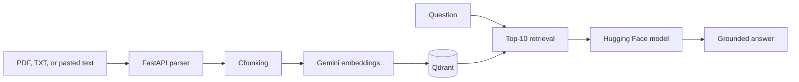

# Sasta NotebookLM

A lightweight document-grounded RAG application inspired by NotebookLM. Upload
a PDF or text file, then ask questions against the indexed content from a React
chat interface.

[Open the live frontend](https://sasta-notebook-lm-frontend.vercel.app/) ·
[View the repository](https://github.com/Raghavendra1729-cell/SastaNotebookLm)

## Features

- drag-and-drop PDF and TXT uploads
- paste-to-source support for quick notes
- 2,000-character chunks with 400-character overlap
- Gemini embeddings stored in local or hosted Qdrant
- top-10 similarity retrieval for each question
- Hugging Face Router generation with configurable model selection
- source reset when a new browser session starts
- responsive React, TypeScript, Vite, and Tailwind interface

## How it works



The backend uses Qdrant Cloud when both `QDRANT_URL` and `QDRANT_API_KEY` are
set. Otherwise it creates a local `BackEnd/local_qdrant/` store.

## Local setup

Requirements: Python 3.11, Node.js, a Hugging Face token, and a Google AI API
key.

### 1. Start the backend

```bash
git clone https://github.com/Raghavendra1729-cell/SastaNotebookLm.git
cd SastaNotebookLm/BackEnd
cp .env.example .env
python3 -m venv .venv
source .venv/bin/activate
pip install -r requirements.txt
uvicorn main:app --reload
```

Set these values in `BackEnd/.env`:

| Variable | Required | Purpose |
|---|---|---|
| `HF_KEY` | Yes | Hugging Face Router token |
| `HF_MODEL` | No | Chat model; defaults to `HuggingFaceH4/zephyr-7b-beta` |
| `GOOGLE_API_KEY` | Yes | Gemini embedding access |
| `CORS_ORIGINS` | No | Comma-separated frontend origins |
| `QDRANT_URL` | No | Qdrant Cloud endpoint |
| `QDRANT_API_KEY` | No | Qdrant Cloud token |

The API starts at `http://localhost:8000`.

### 2. Start the frontend

In a second terminal:

```bash
cd SastaNotebookLm/Frontend
cp .env.example .env
npm install
npm run dev
```

`Frontend/.env` uses `BACKEND_URI=http://localhost:8000` by default. Open the
Vite URL shown in the terminal, normally `http://localhost:5173`.

## API surface

| Method | Path | Purpose |
|---|---|---|
| `GET` | `/` | Health response |
| `POST` | `/upload` | Parse and index one PDF or TXT file |
| `POST` | `/chat` | Retrieve context and generate an answer |
| `DELETE` | `/clear` | Reset the Qdrant collection |

Example chat request:

```bash
curl -X POST http://localhost:8000/chat \
  -H 'Content-Type: application/json' \
  -d '{"message":"Summarize the uploaded document","history":[]}'
```

## Project structure

```text
.
├── BackEnd/
│   ├── routes/             # Upload, clear, and chat endpoints
│   ├── services/           # Embedding, retrieval, and generation
│   ├── core/               # Configuration and prompts
│   └── main.py             # FastAPI application
└── Frontend/
    └── src/                # React interface and source/chat components
```

## Current scope

The collection is shared by the running backend and is cleared by the frontend
when it mounts. This prototype is intended for one active notebook session; it
does not yet provide user accounts, per-user collections, durable notebook
management, or citations tied to page numbers.
